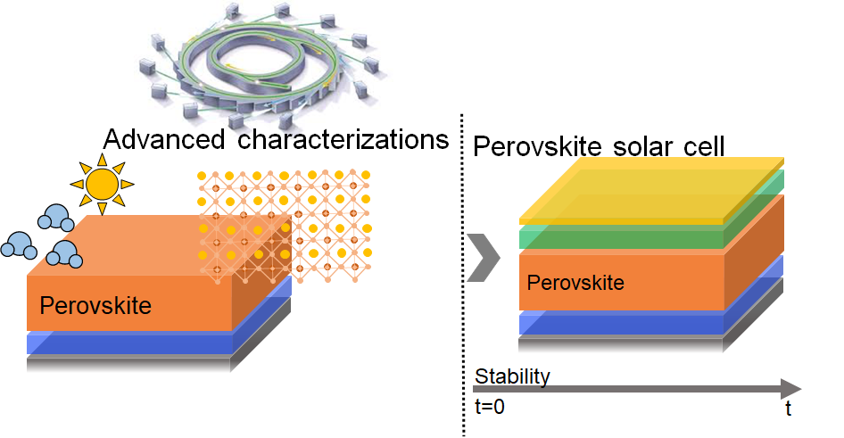
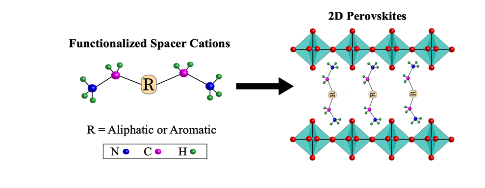
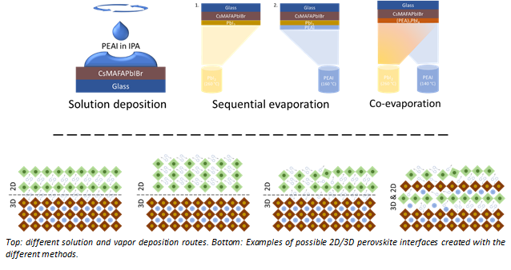
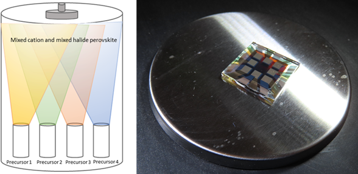
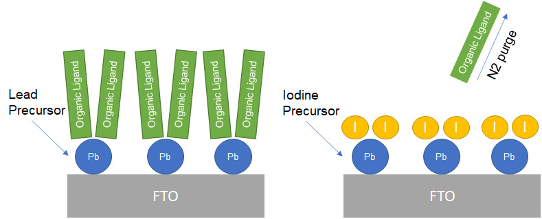

# Research

## Perovskite Solar Cells

The efficiencies of perovskite solar cells have gone from single digits to a certified 22.7% in a few years’ time. At this stage of their development, the key issues are how to further improve efficiencies and, very importantly, their long-term stability. As photocurrents are near the theoretical maximum, my focus is on the increase in open-circuit voltage by improvements in the charge-selective contacts and in the charge carrier lifetimes in perovskites, e.g., via surface passivation. Perovskite solar cells promise to be revolutionary in the photovoltaic field, but the quest to understand and fix degradation mechanisms needs to be of priority to achieve long-term device stability. A Review on this subject was published in Science on November 10, 2017, including the cover for that edition as seen in the picture to the upper left. For a thorough Review on the field see the publication in Energy & Environmental Science 10, 710-727 (2017). Schematic of a solar cell device and the corresponding cross-sectional scanning electron micrograph are shown in the the upper right corner.

The planar junction PSC is a simple architecture type and is advantageous for large-scale manufacturing. The device is composed of a simple stack of conductive glass, electron selective, perovskite, and hole transport layers, topped by a metal electrode. These low cost, low temperature mesoporous-free planar devices have struggled to keep up the high efficiencies garnered by their mesoporous counterparts.

Recent breakthroughs by some of us in the community have changed this dynamic, showing that highly efficient planar PSCs are possible by understanding energetics and improving processing. Employing atomic layer deposited SnO2 as the electron selective layer has yielded efficiencies of 19.5%. More recently, we demonstrated the use of solution-processed SnO2 in planar devices that yielded a record for planar PSCs of 21%. The results of these efforts can be found in the following publications:

1. Energy & Environmental Science 8, 2928-2934 (2015). EES 2015 most accessed articles. 2016 RSC Prize.
2. Energy & Environmental Science 9, 3128-3134 (2016).
3. Energy & Environmental Science,  (2018). Advance Article.

## Advanced Characterization Techniques

- We study different degradation pathways through advanced characterization with the goal of understanding and optimizing stability in perovskites for solar cell applications.
- With different advanced characterization techniques we examine the microstructure, nano structure and chemical properties of perovskites correlated to the electrical performance of the solar cell.

## 2D Perovskites

- We are developing functionalized organic spacer cations that control the orientation of growth and modify the electronic properties (exciton binding energy, band-gap, etc.) of 2D perovskites.
- We are investigating the influence of the spacer cation’s intrinsic properties on stability and performance of 2D and 2D/3D hybrid perovskite solar cells.

## Interfacial Passivation

- Thin 2D perovskite films effectively prevent electron-hole recombination at perovskite interfaces and result in higher PCEs.
- We seek to understand the structural and morphological differences between solution and vapor deposited passivation layers.
- We are using different vapor deposition routes to control the 2D/3D interface and 2D perovskite orientation.
- We are using vapor deposited interfaces to enable PCEs beyond present limits.

## Thermal Evaporation

- We are investigating thermal coevaporation of perovskites as a way to solve issues such as the lack of scalability that PSCs must overcome to  become commerically feasible
- Advantages  of thermal coevaporation over traditional solution deposition include:
  - The process happens inside of a vacuum chamber, so the perovskite is not affected by the environment
  - There is more control over the thickness of the film and its uniformity
  - It is solvent free
  - t is compatible with large area substrates
  - It is compatible with the current industry of photovoltaics
- We use a four-source thermal evaporator (KJLC) to study how to optimize the deposition of perovskite thin film with varying stoichiometry

## Tandem Devices

- In collaboration with the group of Prof. Ajeet Rohatgi, we seek to develop a highly efficient n-TOPCon/n/p+ emitter and n-TOPCon/n/p-TOPCon back junction and/or p-TOPCon/n/n-TOPCon front junction Si bottom cell.
- We seek to design tandem structures of perovskite-Si using high-temperature resistant TOPCon silicon solar cells.
- We seek to increase the PCE, open-current voltage, short-circuit current, and fill factor of both the silicon and perovskite solar cells.
- We are investigating methods of decreasing hystersis in perovskite solar cells.
- We seek to improve the long-term stability of the tandem devices under working conditions.

## Atomic Layer Deposition

- We seek to use the sequential, self-limiting nature of atomic layer deposition to vapor-deposit perovskite films
- Atomic Layer Deposition (ALD) and Molecular Layer Deposition (MLD) theoretically allow for the complete deposition of hybrid organic-inorganic perovskite
- We are improving upon past research to deposit lead iodide films (see figure) and seek to further advance by converting lead iodide to perovskite using MLD
  - Advantages of ALD/MLD over solution processing include:
  - It is solvent free
  - The entire process takes place in low vacuum (<1 torr)
  - Potential for scalability
  - High thickness uniformity and control
  - Ability to deposit monolayer-thick films (2-D perovskite)